# Audit navigace

Mapa toho, co v appce zabírá pozornost a jak se mezi tím chodí. Vzniká ve
čtyřech bězích; tenhle soubor je jediné, co se při nich mění.

**Stav: hotové všechny čtyři běhy.** Prošel jsem všech 243 obsluh, hloubku a hustotu
změřil v běžící appce a zjištění rozdělil na ta, která stojí sama o sobě,
a ta, která bez četnosti rozhodnout nejdou. Běhy 2–4 na tenhle soubor navazují
a používají stálé značky `U*`, `H*`, `Z*`, `R*` — jednou přidělené se nemění.

---

## §1 Uzly

Uzel = cokoli, co zabere pozornost celou nebo skoro celou obrazovkou.
Ovládací prvek uvnitř uzlu (hvězdička, přepínač, pole) uzel není.

### Obrazovky se záložkou ve spodní liště

| U | Jméno | Soubor | K čemu je |
|---|---|---|---|
| U01 | Domů | `views/home/home.js` | co dnes — pozdrav, výprava, počasí, tipy |
| U02 | Mapa | `map/map.js` + `views/mapa/mapa.js` | kde to je |
| U03 | Objevuj | `views/discover/discover.js` | nevím, kam chci |
| U04 | Seznam | `views/list/list.js` | vím, co chci |
| U05 | Plán | `views/plan/plan.js` | jak to pojedeme — obal tří karet |

### Karty uvnitř Plánu

Segment je přepínač, ale každá karta má jiný obsah i jiné akce, takže se
chová jako samostatný uzel. Drží je `dil` (`plan.js:82`).

| U | Jméno | Soubor | K čemu je |
|---|---|---|---|
| U06 | Plán · Na cestě | `views/plan/cesta.js` | probíhající cesta, odškrtávání, mini-mapa |
| U07 | Plán · V plánu | `views/plan/vypravy.js` | knihovna výprav a složek |
| U08 | Plán · Za námi | `views/plan/archiv.js` | ukončené cesty po letech |
| U09 | Itinerář | `views/plan/plan.js` | vnitřek jedné výpravy — dny, zastávky, body |

### Obrazovky bez záložky

| U | Jméno | Soubor | K čemu je |
|---|---|---|---|
| U10 | Profil | `views/profil/profil.js` | kdo jsem a co mám za sebou |
| U11 | Nastavení | `views/nastaveni/nastaveni.js` | jak to má fungovat |
| U12 | Poznámkovač | `views/debug/debug.js` | seznam debug záznamů; načítá se až při otevření |

### Překryvy

Všech jedenáct se hlásí přes `registrujOverlay()`, takže je systémové Zpět
zavírá místo odchodu z obrazovky.

| U | Jméno | Soubor | K čemu je |
|---|---|---|---|
| U13 | Detail místa | `components/sheet.js` + `views/detail/detail.js` | jedno místo — fotka, poznámka, hvězdy, sousedi |
| U14 | Filtry | `components/filterPanel.js:269` | úplný výběr filtrů |
| U15 | Nabídka „+" | `components/plusMenu.js:101` | rozcestník čtyř způsobů, jak něco přidat |
| U16 | Průvodce výletem | `components/wizard.js:139` | poskládá výpravu podle nálady a času |
| U17 | Formulář místa do repozitáře | `components/addForm.js:570` | vyrobí JSON záznam, do appky nic nepřidá |
| U18 | Zápis poznámky | `components/debugZapis.js:596` | debug formulář, nový i úprava |
| U19 | Dialog, který vyústí jinde | `components/dialog.js:415` | **jen ty dialogy, po jejichž potvrzení člověk skončí v jiném uzlu.** Ostatní uzel nejsou — viz pravidlo pod tabulkou |
| U20 | Košík | `components/kosikFab.js:141` | plovoucí plát s odloženými místy |
| U21 | Výběr místa | `components/vyberMista.js:124` | hledání místa do plánu |
| U22 | Porovnání | `views/porovnani/porovnani.js:122` | dvě až tři místa vedle sebe |
| U23 | Nabídka navigace | `views/plan/plan.js`, registrace `main.js:102` | do které navigace poslat cíl |

**Dialog uzel většinou není.** `potvrd()`, `zadej()`, `vyberZeSeznamu()`,
`vyberVice()`, `vyberDatum()` i `vyberPocetDni()` se **vracejí volajícímu** —
po zavření je člověk tam, odkud dialog otevřel. Takový dialog je proto značka
na hraně, ne uzel, a v grafu se nekreslí. Uzel je jen tehdy, když po potvrzení
skončí jinde; prošel jsem všechna volání a takový je **jediný**: „Nová výprava"
(`plan.js:1187`), po kterém se otevře Itinerář. Je to hrana H58.

### Režimy mapy

Nejsou to překryvy — mapa zůstane, ale ovládá se jinak a nejde z ní odejít jinam.

| U | Jméno | Soubor | K čemu je |
|---|---|---|---|
| U24 | Výběr míst špendlíky | `map/map.js:333` | naklikat víc míst do nové výpravy |
| U25 | Výběr bodu ťuknutím | `map/map.js:392` | vybrat souřadnici pro vlastní bod |

### Ostatní

| U | Jméno | Soubor | K čemu je |
|---|---|---|---|
| U26 | Uvítání | `components/intro.js:84` | tři kroky při prvním spuštění |
| U27 | Plát uložených míst | `views/mapa/mapa.js:113` | vytahovací seznam pod mapou |
| U28 | Karta výpravy | `components/vypravaKarta.js` | tentýž díl na Domů i na Mapě |

---

## §2 Hrany

Sloupec **zpět** říká, jak se člověk dostane tam, odkud přišel.

### Spodní lišta a hlavička

| H | Odkud → kam | Čím | Gesto | Důkaz | Zpět |
|---|---|---|---|---|---|
| H01 | kterýkoli uzel → U01 | záložka Domů | dotyk | `main.js:105` | záložkou |
| H02 | kterýkoli uzel → U02 | záložka Mapa | dotyk | `main.js:105` | záložkou |
| H03 | kterýkoli uzel → U03 | záložka Objevuj | dotyk | `main.js:105` | záložkou |
| H04 | kterýkoli uzel → U04 | záložka Seznam | dotyk | `main.js:105` | záložkou |
| H05 | kterýkoli uzel → U05 | záložka Plán | dotyk | `main.js:105` | záložkou |
| H06 | kterýkoli uzel → U10 | kolečko s panáčkem | dotyk | `main.js:122` | systémové Zpět |
| H07 | kterýkoli uzel → U11 | ozubené kolečko | dotyk | `main.js:123` | systémové Zpět |
| H08 | kterýkoli uzel → U18 | kolečko s broukem | dotyk | `main.js:128` | Zavřít / systémové Zpět |
| H09 | kterýkoli uzel → U12 | kolečko se seznamem | dotyk | `main.js:130` | systémové Zpět |

Kolečka H08 a H09 jsou v hlavičce vidět jen se zapnutým `prefs.debugRezim`.

**Čísla hran nejdou souvisle** — H37 a H51 zanikly, když se dialog přestal
považovat za uzel. Značky se podle zadání nerecyklují, takže po nich zůstala
díra a nová hrana dostala H74.

### Cesta k místu

| H | Odkud → kam | Čím | Gesto | Důkaz | Zpět |
|---|---|---|---|---|---|
| H10 | U01 → U02 | dlaždice nebo řádek místa | dotyk | `home.js:88`, `home.js:91` → `map/map.js:226` | záložkou |
| H11 | U03 → U02 | karta místa | dotyk | `discover.js:209` → `map/map.js:226` | záložkou |
| H12 | U04 → U02 | řádek místa | dotyk | `list.js:226` → `map/map.js:226` | záložkou |
| H13 | U27 → U02 | řádek uloženého místa | dotyk | `mapa.js:229` → `map/map.js:226` | záložkou |
| H14 | U02 → U13 | doletění k místu po `goTo` | žádné, samo po 450 ms | `map/map.js:231` | Zavřít |
| H15 | U02 → U13 | špendlík na mapě | dotyk | `map/map.js:207` | Zavřít |
| H16 | U13 → U13 | soused v „Co je poblíž" | dotyk | `detail.js:372`, `:401`, `:409` | Zavřít |
| H17 | U13 → U02 | mini-mapa v detailu | dotyk | `detail.js:426` → `map/map.js:226` | Zavřít detailu |
| H18 | U13 → U22 | Porovnat | dotyk | `detail.js:363` → `porovnani.js:56` | Zavřít |

**H10 až H13 jsou o jednu obrazovku delší, než vypadají.** Ťuknutí na kartu
místa neotevře detail — přepne na Mapu, přiletí ke špendlíku a teprve pak
otevře detail. Jsou to dva uzly za jeden dotyk (`map/map.js:226–232`).

### Objevuj a Seznam

| H | Odkud → kam | Čím | Gesto | Důkaz | Zpět |
|---|---|---|---|---|---|
| H19 | U03 → U02 | dlaždice oblasti | dotyk | `discover.js:213–222` | záložkou |
| H20 | U03 → U04 | Zobrazit vše | dotyk | `discover.js:229` | záložkou |
| H21 | U03 → U04 | rychlá inspirace | dotyk | `discover.js:255` | záložkou |
| H22 | U01 → U03 | nálada „Něco blízko" | dotyk | `home/moods.js:34` | záložkou |
| H23 | U01 → U02 | ostatní nálady | dotyk | `home/moods.js:43` | záložkou |
| H24 | U01 → U02 | nálada „Překvap mě" | dotyk | `home/moods.js:83` | záložkou |
| H25 | U04 → U14 | ikona trychtýře | dotyk | `filterPanel.js:212` | Zavřít |
| H26 | U14 → U01 | Ukázat výsledky / Vyčistit | dotyk | `filterPanel.js:317`, `:332` | záložkou |
| H71 | U03 → U02 | dlaždice kolekce | dotyk | `discover.js:203` → `discover.js:238` | záložkou |
| H72 | U02 → U14 | trychtýř nad mapou | dotyk | `filterPanel.js:209` | Zavřít |
| H73 | U11 → U01 | Vrátit vestavěná data | dotyk | `filterPanel.js:326` → `:332` | záložkou |

### Plán

| H | Odkud → kam | Čím | Gesto | Důkaz | Zpět |
|---|---|---|---|---|---|
| H27 | U05 → U06 / U07 / U08 | segment tří karet | dotyk | `plan.js:1173–1180` | segmentem |
| H28 | U07 → U09 | řádek výpravy | dotyk | `plan.js:458` | drobečky |
| H29 | U08 → U09 | řádek ukončené cesty | dotyk | `plan.js:462` | drobečky |
| H30 | U01 → U09 | Otevřít plán na kartě výpravy | dotyk | `home.js:85` → `plan.js:281` | záložkou |
| H31 | U01 → U06 | tatáž akce, když se jede | dotyk | `home.js:85` → `plan.js:294` | záložkou |
| H32 | U09 → U02 | Ukázat na mapě | dotyk | `plan.js:1254` | záložkou |
| H33 | U09 → U23 | Navigovat | dotyk | `plan.js:1291` | Zavřít |
| H34 | U09 / U06 → U20 | kolečko košíku vpravo dole | dotyk | `kosikFab.js:137` | tímtéž kolečkem |
| H35 | U20 → U09 | tažení místa z košíku do dne | tažení | `plan.js:1446`, `:1453` | — |
| H36 | U09 → U09 | přesun zastávky mezi dny | tažení nebo dlouhé podržení | `plan.js:1446`, `:1453` | — |
| H38 | U09 → U25 | Vybrat na mapě u vlastního bodu | dotyk | `map/map.js:392` | vrací se samo, `map.js:430` |
| H58 | U07 → U19 | Nová výprava — otevře se pole na název | dotyk | `plan.js:1187` | Zrušit vrátí do U07 |
| H74 | U19 → U09 | potvrzení názvu otevře Itinerář | dotyk | `plan.js:1187–1192` | drobečky |
| H59 | U09 → U06 | Vyjet | dotyk | `plan.js:1202` | segmentem |
| H60 | U09 → U21 | Přidat zastávku | dotyk | `plan.js:1211` | Zavřít |
| H61 | U09 → U20 | Do košíku, i dlaždicí dashboardu | dotyk | `plan.js:1226`, `plan.js:1164` | tímtéž kolečkem |
| H62 | U09 → U07 | drobečky Zpět | dotyk | `plan.js:1230` | řádkem výpravy |
| H63 | U09 → U02 | zastávka „Ukázat" | dotyk | `plan.js:1299` | záložkou |
| H64 | U08 → U09 | ukončená cesta se aktivuje | dotyk | `archiv.js:138` | drobečky |
| H65 | U09 → ven z appky | Navigovat do Apple Maps / Waze / Google | dotyk | `plan.js:1796`, `:1800`, `:1745` | jen přepnutím aplikace |
| H66 | U06 → ven z appky | Navigovat na další cíl | dotyk | `cesta.js:673` | jen přepnutím aplikace |
| H75 | U09 → U07 | Smazat ukončenou cestu v zamčeném Itineráři | dotyk | `cesta.js:406`, ověřeno v prohlížeči | řádkem v Za námi |

### Přidávání

| H | Odkud → kam | Čím | Gesto | Důkaz | Zpět |
|---|---|---|---|---|---|
| H39 | U02 → U15 | kolečko „+" na mapě | dotyk | `plusMenu.js:58` | tímtéž kolečkem |
| H40 | U15 → U21 | Přidat zastávku | dotyk | `plusMenu.js:60` | Zavřít |
| H41 | U15 → U24 | Vybrat na mapě | dotyk | `plusMenu.js:69` → `map/map.js:333` | Hotovo / Zrušit |
| H42 | U15 → U17 | Přidat místo | dotyk | `plusMenu.js:84` | Zavřít |
| H43 | U15 → U16 | Naplánovat výlet | dotyk | `plusMenu.js:88` | Zavřít |
| H44 | U01 → U16 | Naplánovat výlet na kartě | dotyk | `home.js:81` | Zavřít |
| H45 | U28 → U16 | tatáž karta na Mapě | dotyk | `mapa.js:188` | Zavřít |
| H46 | U24 → U09 | Hotovo po naklikání špendlíků | dotyk | `plusMenu.js:69–82` | drobečky |
| H67 | U16 → U09 | průvodce doběhl a otevřel Itinerář | dotyk na „Naplánovat" | `wizard.js:86` → `wizard.js:131–132` | drobečky |
| H68 | U24 → odkud přišel | Hotovo / Zrušit v lístku režimu | dotyk | `map/map.js:347` | — |
| H69 | U25 → odkud přišel | Hotovo / Zrušit v lístku režimu | dotyk | `map/map.js:420`, návrat `map.js:430` | — |
| H70 | U20 → U25 | Přidat vlastní místo z košíku | dotyk | `kosikView.js:387` | vrací se samo |

### Nastavení, Profil, Poznámkovač

| H | Odkud → kam | Čím | Gesto | Důkaz | Zpět |
|---|---|---|---|---|---|
| H47 | U11 → U12 | Otevřít poznámkovač | dotyk | `nastaveni.js:529` | systémové Zpět |
| H48 | U12 → U18 | Zapsat poznámku | dotyk | `debug.js:959` | Zavřít |
| H49 | U12 → U18 | Upravit záznam | dotyk | `debug.js:824` | Zavřít |
| H50 | U18 → U12 | Uložit a otevřít seznam | dotyk | `debugZapis.js:554` | systémové Zpět |
| H52 | U10 → U25 | Vybrat z mapy u pozice | dotyk | `pozice.js:51` → `map/map.js:392` | vrací se samo |

### Mapa zdola

| H | Odkud → kam | Čím | Gesto | Důkaz | Zpět |
|---|---|---|---|---|---|
| H53 | U02 → U27 | úchyt plátu uložených míst | dotyk | `mapa.js:113` | tímtéž úchytem |
| H54 | U02 → U28 | bublina sbalené karty výpravy | dotyk | `mapa.js:109` | šipkou, `mapa.js:196` |
| H55 | U02 → U04 | Zobrazit vše nad uloženými | dotyk | `mapa.js:216` | záložkou |

### Start

| H | Odkud → kam | Čím | Gesto | Důkaz | Zpět |
|---|---|---|---|---|---|
| H56 | start → U26 | první spuštění, `store.seen` prázdné | žádné | `intro.js:84–85` | — |
| H57 | U26 → U01 | Jedeme / Přeskočit | dotyk | `intro.js:79` | zpátky se nedá |

---

## §2b Nejisté hrany

**Žádná nezbyla.** Obě, které po běhu 1 zůstaly otevřené, jsem rozhodl
zkouškou v appce, ne odhadem — a **dopadly každá jinak**, takže odhad by
jednu z nich minul.

| Co jsem zkusil | Jak to dopadlo |
|---|---|
| „Smazat výpravu" v Itineráři (`plan.js:1700`) | **Není hrana.** Drobečky zůstaly, zastávek 0, výprava se přejmenovala na fantoma „Náš plán". Člověk stojí v Itineráři něčeho, co už neexistuje. |
| „Smazat cestu" v zamčeném Itineráři (`cesta.js:406`) | **Je hrana** → nová H75. Drobečky zmizely a appka se vrátila do knihovny „V plánu". |

Postup: nasazený plán o třech zastávkách, otevřít Itinerář, smazat; u cesty
navíc vyjet a ukončit, aby vůbec nějaká v archivu byla. Měřil jsem přítomnost
drobečků (`#planZpet`), počet zastávek a text `#planWrap`.

Dřívější nejistoty z běhu 1 jsou vyřešené: dialogy přestaly být uzlem
(pravidlo v §1), `vyberVypravy()` v `detail.js:55` se vrací volajícímu,
průvodce po dokončení otevírá Itinerář (H67), `components/tah.js:55` je obecný
pomocník pro tažení a sám žádnou hranu nedělá, a do U22 vede jediná cesta, H18.

## §3 Diagram

```mermaid
flowchart TD
  START([spuštění appky]) --> U26[U26 Uvítání]
  U26 -->|Jedeme| U01

  subgraph zalozky[Spodní lišta]
    U01[U01 Domů]
    U02[U02 Mapa]
    U03[U03 Objevuj]
    U04[U04 Seznam]
    U05[U05 Plán]
  end

  subgraph planKarty[Karty Plánu]
    U06[U06 Na cestě]
    U07[U07 V plánu]
    U08[U08 Za námi]
    U09[U09 Itinerář]
  end

  subgraph bezZalozky[Bez záložky]
    U10[U10 Profil]
    U11[U11 Nastavení]
    U12[U12 Poznámkovač]
  end

  subgraph prekryvy[Překryvy]
    U13[U13 Detail místa]
    U14[U14 Filtry]
    U15[U15 Nabídka plus]
    U16[U16 Průvodce výletem]
    U17[U17 Formulář místa<br/>do repozitáře]
    U18[U18 Zápis poznámky]
    U19[U19 Dialog Nová výprava]
    U20[U20 Košík]
    U21[U21 Výběr místa]
    U22[U22 Porovnání]
    U23[U23 Nabídka navigace]
  end

  subgraph rezimy[Režimy mapy]
    U24[U24 Výběr špendlíky]
    U25[U25 Výběr bodu]
  end

  VEN([navigace mimo appku])
  U27[U27 Plát uložených]
  U28[U28 Karta výpravy]

  U01 -->|H10 karta místa| U02
  U03 -->|H11 karta místa| U02
  U04 -->|H12 řádek místa| U02
  U27 -->|H13 řádek| U02
  U02 -->|H14 po doletění| U13
  U02 -->|H15 špendlík| U13
  U13 -->|H16 soused| U13
  U13 -->|H17 mini-mapa| U02
  U13 -->|H18 Porovnat| U22

  U03 -->|H19 oblast| U02
  U03 -->|H20 Zobrazit vše| U04
  U03 -->|H21 inspirace| U04
  U01 -->|H22 Něco blízko| U03
  U01 -->|H23 nálada| U02
  U04 -->|H25 trychtýř| U14
  U02 -->|H72 trychtýř| U14
  U03 -->|H71 kolekce| U02
  U14 -->|H26 Ukázat výsledky| U01

  U05 -->|H27 segment| U06
  U05 -->|H27 segment| U07
  U05 -->|H27 segment| U08
  U07 -->|H28 řádek výpravy| U09
  U08 -->|H29 ukončená cesta| U09
  U01 -->|H30 Otevřít plán| U09
  U01 -->|H31 za jízdy| U06
  U09 -->|H32 Ukázat na mapě| U02
  U09 -->|H33 Navigovat| U23
  U09 -->|H34 kolečko košíku| U20
  U20 -.->|H35 tažením| U09
  U09 -.->|H36 tažením| U09
  U09 -->|H38 Vybrat na mapě| U25
  U07 -->|H58 Nová výprava| U19
  U19 -->|H74 potvrzení| U09
  U09 -->|H59 Vyjet| U06
  U09 -->|H60 Přidat zastávku| U21
  U09 -->|H61 Do košíku| U20
  U09 -->|H62 drobečky| U07
  U09 -->|H63 zastávka Ukázat| U02
  U08 -->|H64 aktivace cesty| U09
  U09 ==>|H65 Navigovat| VEN
  U06 ==>|H66 Navigovat| VEN

  U02 -->|H39 kolečko plus| U15
  U15 -->|H40 Přidat zastávku| U21
  U15 -->|H41 Vybrat na mapě| U24
  U15 -->|H42 Přidat místo| U17
  U15 -->|H43 Naplánovat výlet| U16
  U01 -->|H44 Naplánovat výlet| U16
  U28 -->|H45 Naplánovat výlet| U16
  U24 -->|H46 Hotovo| U09
  U16 -->|H67 hotový výlet| U09
  U20 -->|H70 vlastní místo| U25

  U11 -->|H47 Otevřít poznámkovač| U12
  U12 -->|H48 Zapsat| U18
  U12 -->|H49 Upravit| U18
  U18 -->|H50 Uložit| U12
  U10 -->|H52 Vybrat z mapy| U25

  U02 -->|H53 úchyt plátu| U27
  U02 -->|H54 bublina| U28
  U02 -->|H55 Zobrazit vše| U04

  U01 -.->|H06 kolečko| U10
  U01 -.->|H07 kolečko| U11
  U09 -->|H75 smazat cestu| U07

  classDef m1 fill:#e8efe4,stroke:#5c6f4e,color:#22301c
  classDef m3 fill:#f6efdc,stroke:#b08e3f,color:#3a2f10
  classDef m5 fill:#f5e3dd,stroke:#a2503c,color:#3d1a12
  class U01,U02,U03,U04,U05,U07,U09,U10,U11,U13,U16,U18,U28,U26 m1
  class U06,U08,U12,U14,U15,U19,U20,U21,U22,U23,U27 m3
  class U17,U24,U25 m5
```



Pásma barev jsou **hloubka v dotycích** ze §5: zelené je jeden dotyk nebo
méně, okrové dva, terakotové tři a víc. Nejhlouběji leží U25 Výběr bodu, na
pátém dotyku.

Čárkovaná hrana znamená přechod, který není obyčejný dotyk na tlačítko:
tažení, nebo kolečko v hlavičce dostupné odkudkoli. Tučná vede **ven z appky**
do cizí navigace. Dialogy v diagramu nejsou vůbec — vracejí se volajícímu,
takže jsou značkou na hraně, ne uzlem. Hrany H01 až H05 v
diagramu nejsou — vedly by z každého uzlu do každé záložky a diagram by
z nich zčernal; jsou v §2.

---

## §4 Pokrytí

Každá obsluha je právě v jedné přihrádce. **Pokrytí = 1 − nepřečteno ÷ celkem.**

| | celkem | hrana | nemění uzel | nepřečteno | pokrytí |
|---|---|---|---|---|---|
| `onclick` | 243 | 58 | 185 | 0 | **100 %** |
| `data-tab` | 5 | 5 | 0 | 0 | **100 %** |
| `emit()` | 13 druhů | 2 | 11 | 0 | **100 %** |
| `onpointerdown` | 4 | 2 | 2 | 0 | **100 %** |

Grep na `onclick` vrací 246 řádků, ale tři z nich jsou **komentáře**, ne
obsluhy: `components/tah.js:24`, `core/chyby.js:16` a
`views/nastaveni/nastaveni.js:405`. Skutečných obsluh je 243.

### Rozpad po souborech

| Soubor | celkem | hrana | nemění uzel |
|---|---|---|---|
| `views/plan/plan.js` | 43 | 13 | 30 |
| `components/dialog.js` | 21 | 0 | 21 |
| `views/nastaveni/nastaveni.js` | 18 | 1 | 17 |
| `views/debug/debug.js` | 16 | 2 | 14 |
| `components/filterPanel.js` | 14 | 3 | 11 |
| `views/plan/cesta.js` | 12 | 1 | 11 |
| `components/addForm.js` | 12 | 0 | 12 |
| `views/detail/detail.js` | 11 | 2 | 9 |
| `views/plan/kosikView.js` | 10 | 1 | 9 |
| `components/debugZapis.js` | 10 | 1 | 9 |
| `src/main.js` | 8 | 5 | 3 |
| `views/discover/discover.js` | 7 | 6 | 1 |
| `views/mapa/mapa.js` | 6 | 4 | 2 |
| `views/home/home.js` | 5 | 3 | 2 |
| `components/plusMenu.js` | 5 | 5 | 0 |
| `views/list/list.js` | 4 | 1 | 3 |
| `views/debug/debugExportUI.js` | 4 | 0 | 4 |
| `components/wizard.js` | 4 | 1 | 3 |
| `components/chip.js` | 4 | 0 | 4 |
| `views/profil/pozice.js` | 3 | 1 | 2 |
| `views/nastaveni/mapaKeStazeni.js` | 3 | 0 | 3 |
| `components/vypravaKarta.js` | 3 | 3 | 0 |
| ostatních 11 souborů po 1–2 | 20 | 5 | 15 |
| **celkem** | **243** | **58** | **185** |

### Proč je hran 72 a součet sloupce „hrana" jen 58

**Počítají se dvě různé věci** a rozdíl 14 je strukturální, ne účetní:

- **Jedna obsluha může obsloužit víc hran.** `main.js:105` visí na všech pěti
  záložkách naráz (H01–H05, +4). `plan.js:1174` přepíná tři karty segmentu
  (H27, +2). `plan.js:1187` je H58 i H74 (+1). `home.js:85` vede jednou na
  Itinerář a jednou na Na cestě podle toho, jestli se jede (H30, H31, +1).
  `detail.js:424` je H16 i H17 (+1). Nálada v `discover.js:206` končí podle
  své definice na třech různých místech (H22–H24, +2).
- **Pět hran nemá `onclick` vůbec.** H14 vzniká časovačem
  (`map/map.js:231`), H15 je Leafletovo `.on('click')` na špendlíku
  (`map/map.js:207`), H35 a H36 jsou tažení (`onpointerdown`) a H56 je start
  aplikace, kde není žádné gesto.
- **A naopak: víc obsluh může dělat jednu hranu.** „Navigovat" má tři
  tlačítka pro tři aplikace, ale ven z appky vede jedna hrana H65 (−2);
  `home.js:88` a `:91` jsou dlaždice i řádek, hrana je jedna, H10 (−1).

Rovnice, ať to není jen výčet:

```
  58   obsluh se stupněm „hrana"
+ 11   jedna obsluha slouží víc hranám
       (záložky +4, segment Plánu +2, nová výprava +1,
        karta výpravy +1, soused v detailu +1, nálady +2)
+  5   hrany bez onclick
       (H14 časovač, H15 Leaflet .on, H35 a H36 tažení, H56 start)
−  3   víc obsluh dělá jednu hranu
       (Navigovat −2, dlaždice i řádek na Domů −1)
+  2   hrany doplněné až měřením v prohlížeči
       (H74 potvrzení názvu, H75 smazání ukončené cesty)
────
  73   hran v §2
```

**Pokrytí měří jen úplnost čtení, ne správnost hran.** Sto procent znamená,
že jsem každou obsluhu otevřel a zařadil — neznamená, že je graf správně.
Důkaz je přímo v tomhle souboru: H37 a H51 byly v běhu 1 nakreslené **chybně**,
ne chybějící, a odhalilo je až tvoje pravidlo o dialozích, ne procenta.

### Co která přihrádka znamená

**Hrana** je obsluha, po které je člověk v jiném uzlu. Je jich 58 a stojí za
73 hranami v §2 — jeden `onclick` na záložkách (`main.js:105`) obsluhuje pět
záložek, karta výpravy má tři cíle podle stavu.

**Nemění uzel** je zbylých 185. Zdaleka nejčastěji: přepnutí předvolby
(`nastaveni.js`, 17×), zavření nebo potvrzení dialogu (`dialog.js`, 21×),
vyplnění pole formuláře (`addForm.js`, 12×), rozbalení a sbalení řádku
(`debug.js`, `plan.js`, `archiv.js`), přepnutí hvězdiček a plamínků
(`detail.js`), zaškrtnutí v košíku (`kosikView.js`).

**Dvě konvence**, aby bylo jasné, proč něco není hrana:

- **Zavření překryvu se počítá jako „nemění uzel".** Návrat je zapsaný ve
  sloupci *zpět* u té hrany, která překryv otevřela — kreslit ho zvlášť by
  graf zdvojnásobilo a nic nepřidalo. Týká se to `addClose`, `dzZrus`,
  `vmClose`, `pvZavri` a podobných.
- **Dialog vracející se volajícímu je značka na hraně, ne uzel.** Prošel jsem
  všechna volání `potvrd`, `zadej`, `vyberZeSeznamu`, `vyberVice`,
  `vyberDatum` a `vyberPocetDni`; jediné, po kterém člověk skončí jinde, je
  „Nová výprava" (`plan.js:1187`, hrana H58).

`emit()`: navigační jsou dva druhy — `otevriDetail` a `skoc`. Zbylých jedenáct
jsou datové události (`prekresleno`, `poloha`, `fotkyNacteny`, `cestyNacteny`,
`trasaNactena`, `ulozeniSelhalo`, `motivZmenen`, `zalozkaZmenena`,
`zivaProjekce`, `debugZmena`, `uvodZavren`) — překreslují uzel, ve kterém
člověk stojí, ale nikam ho neposílají.

`onpointerdown`: `plan.js:1446` a `:1453` jsou hrany H35 a H36 (tažení
zastávky a přesun z košíku). `plan.js:547` sbaluje den a `components/tah.js:55`
je obecný pomocník pro tažení plátů — ani jeden uzel nemění.

## §5 Vrstvy

Tři čísla ke každému uzlu. Seřazeno podle hloubky sestupně.

**Hloubka se počítá v DOTYCÍCH**, ne v uzlech, a měří se od startu appky —
Domů, nic otevřeného. Systémové Zpět se jako dotyk navíc nepočítá.

**Hustota je počet ovládacích prvků viditelných naráz v jednom stavu
obrazovky.** Změřeno v prohlížeči na 390×844: sečteno jen to, co má rozměr
a leží ve výřezu, uvnitř kontejneru daného uzlu. **Stálý chrome se nepočítá** —
spodní lišta má 5 prvků a hlavička 2 (nebo 5 se zapnutým debug režimem) a jsou
všude stejné. Hustota je vždy z **nerolované obrazovky**, není-li u řádku
uvedeno jinak.

**Stupeň** je počet hran ze §2. `*` znamená, že do uzlu vede hrana
„z kteréhokoli uzlu" (záložky a kolečka v hlavičce).

| U | Uzel | Hloubka | Hustota | Dovnitř | Ven |
|---|---|---|---|---|---|
| U25 | Výběr bodu ťuknutím | **7** | neměřeno | 3 | 1 |
| U17 | Formulář místa do repozitáře | 3 | neměřeno | 1 | **0** |
| U24 | Výběr míst špendlíky | 3 | neměřeno | 1 | 2 |
| U08 | Plán · Za námi | 2 | 3 | 1 | 2 |
| U06 | Plán · Na cestě | 2 (1 když se jede) | 4 | 3 | 2 |
| U12 | Poznámkovač | 2 (1 kolečkem) | neměřeno | 3 | 2 |
| U14 | Filtry | 2 | 20 | 2 | 1 |
| U15 | Nabídka „+" | 2 | neměřeno | 1 | 4 |
| U19 | Dialog Nová výprava | 2 | neměřeno | 1 | 1 |
| U20 | Košík | 2 | neměřeno | 3 | 2 |
| U21 | Výběr místa | 2 | neměřeno | 2 | **0** |
| U22 | Porovnání | 2 | neměřeno | 1 | **0** |
| U23 | Nabídka navigace | 2 | neměřeno | 1 | **0** |
| U27 | Plát uložených míst | 2 | neměřeno | 1 | 1 |
| U02 | Mapa | 1 | 4 | 12* | 7 |
| U03 | Objevuj | 1 | 13 | 2* | 5 |
| U04 | Seznam | 1 | 12 | 4* | 2 |
| U05 | Plán | 1 | — obal | 1* | 3 |
| U07 | Plán · V plánu | 1 | 5 | 2 | 2 |
| U09 | Itinerář | 1 | **20 / 17 / 20** | 9 | 11 |
| U10 | Profil | 1 | 4 | 1* | 1 |
| U11 | Nastavení | 1 | 12 | 1* | 2 |
| U13 | Detail místa | 1 | neměřeno | 3 | 3 |
| U16 | Průvodce výletem | 1 | neměřeno | 3 | 1 |
| U18 | Zápis poznámky | 1 kolečkem, jinak 3 | neměřeno | 3* | 1 |
| U01 | Domů | 0 | 2 | 4* | 7 |
| U26 | Uvítání | 0 (jen první spuštění) | neměřeno | 1 | 1 |
| U28 | Karta výpravy | 0 (je na Domů) | neměřeno | 1 | 1 |

### Plán rozepsaný po stavech

Jedno číslo za Itinerář by lhalo — je to jeden uzel, ale čtyři různé obrazy
podle toho, kam je odrolováno. Proto tři měření zvlášť:

| Stav | Hustota | Odkud je číslo |
|---|---|---|
| Itinerář · přehled výpravy | **20** | shora, nerolováno: segment, drobečky, „…", termín, dlaždice dashboardu, Vyjet |
| Itinerář · den se zastávkami | **17** | odrolováno na první `.denhd`: hlavička dne, tři zastávky s úchyty a „…", Přidat bod |
| Itinerář · mapa dne | **20** | odrolováno na `#dashMapa`: mini-mapa se zámkem plus okolní tlačítka |
| Plán · V plánu (knihovna) | 5 | shora: segment, Nová výprava, řádek výpravy |
| Plán · Na cestě | 4 | shora, bez rozjeté cesty: segment a Vyjet |
| Plán · Za námi | 3 | shora: jen segment a rok |

**Plán tedy nemá jednu hustotu, ale rozpětí 3 až 20** podle karty a odrolování.
Nejhustší obraz v celé appce je remíza: Itinerář a Filtry, oba dvacet.

### Hustota rozdělená: různé prvky × opakující se položky

Dvacet prvků neznamená totéž na galerii a na formuláři. **Různý prvek** dělá
něco jiného než jeho soused a musí se přečíst; **položka seznamu** je desátá
kopie téhož a čte se jednou. Rozděleno podle toho, jestli prvek leží uvnitř
`.radek`, `.zastavka`, `.fotokarta` nebo `.dlazdice`:

| Stav | celkem | různých | v položkách |
|---|---|---|---|
| U14 Filtry | 20 | **20** | 0 |
| U09 Itinerář · přehled výpravy | 20 | **18** | 2 |
| U09 Itinerář · mapa dne | 20 | **18** | 2 |
| U09 Itinerář · den se zastávkami | 17 | 11 | 6 |
| U03 Objevuj | 13 | **0** | 13 |
| U11 Nastavení | 12 | 12 | 0 |
| U04 Seznam | 12 | 8 | 4 |
| U07 Plán · V plánu | 5 | 5 | 0 |
| U06 Plán · Na cestě | 4 | 4 | 0 |
| U10 Profil | 4 | 4 | 0 |
| U02 Mapa · chrome | 4 | 4 | 0 |
| U08 Plán · Za námi | 3 | 3 | 0 |
| U01 Domů | 2 | 2 | 0 |

**Tohle převrací pořadí.** Objevuj má třináct prvků a **ani jeden z nich není
jiný než ostatní** — je to galerie kolekcí a nálad, přečte se jednou a dál se
jen vybírá. Filtry a Itinerář mají dvacet a **osmnáct až dvacet z nich se
navzájem liší**. Hustota bez tohohle rozdělení Objevuj obviňuje a Nastavení
omlouvá, přestože je to naopak.

### Co je na těch číslech vidět

- **Čtyři uzly mají stupeň ven nula**: U17 Formulář místa, U21 Výběr místa,
  U22 Porovnání, U23 Nabídka navigace. Ven z nich vede jen zavření.
- **U09 Itinerář je uzlem s nejvyšším stupněm** — 9 dovnitř, 11 ven. Je to
  křižovatka Plánu, ne obrazovka.
- **U25 leží nejhlouběji, v SEDMÉM dotyku.** V běhu 2 jsem napsal pátý; bylo
  to spočítané z kódu a bylo to špatně. Naklikáno v prohlížeči, dotyk po
  dotyku: záložka Plán → řádek výpravy → Přidat bod → *Jaký bod přidat?* →
  *Název bodu* → *Do kterého dne?* → *Kde to je? → Ťuknout do mapy*. **Čtyři
  ze sedmi dotyků jsou dialogy**, které se vracejí volajícímu.

### Hloubka H10–H13: jeden dotyk, dva uzly a 450 ms

U **U13 Detail místa** je hloubka **1**, ne 2, a je to poctivé jen napůl.
Jedním dotykem na kartu místa na Domů, v Objevuj, v Seznamu nebo v plátu
uložených se člověk ocitne v Detailu — jenže po cestě appka přepne na Mapu,
odletí ke špendlíku a **teprve po 450 ms** otevře Detail (`map/map.js:226–232`).

Mezi dotykem a výsledkem je tedy prodleva, po kterou se dívá na něco třetího.
Hloubka to nevidí — ta počítá dotyky a ty jsou opravdu jedna. Připomínám to
tady proto, že v běhu 3 je to kandidát na nález, který by z čísel samotných
nevypadl.

---

## §5b Co tahle mapa neumí

Tohle je mapa **struktury**, ne chování. Umí říct, kolik dotyků kam vede a co
je vidět naráz, ale neví **jak často se kudy chodí** — a bez četnosti je
hloubka jen tvrzení, ne problém. Uzel v pátém patře, do kterého se jde jednou
za rok, je v pořádku; uzel ve druhém patře, kterým se prochází dvacetkrát
denně, může být tou horší chybou.

Tři uzly, které by četnost nejspíš přeřadila:

1. **U13 Detail místa** je dnes hloubka 1 a v tabulce vypadá levně. Je to ale
   nejspíš nejnavštěvovanější uzel celé appky, a těch 450 ms čekání se pak
   nenasčítá jednou, ale stokrát. S četností by se posunul nahoru, ne dolů.
2. **U20 Košík** má hloubku 2 a stupeň 3/2, tedy nic nápadného. Jestli se ale
   na cestě otvírá pokaždé, když se přidává zastávka, je to nejvytíženější
   překryv v appce a jeho hloubka je o dotyk vyšší, než by měla být.
3. **U09 Itinerář** má nejvyšší stupeň a nejvyšší hustotu. Četnost by ale
   ukázala něco jiného: jestli se v něm člověk zdržuje **před cestou**
   (plánování, hustota vadí míň), nebo **za jízdy** (pak je dvacet prvků na
   obrazovce za volantem hodně).

**Data už se sbírají a nikdo je nečte.** `prefs.moodUse` počítá, kolikrát byla
která nálada použita — zapisuje se v `views/home/moods.js:26` a v celém repu
se nikde nečte. Je to zapsané v `NAPADY.md` jako **N9**. Je to jediné měření
chování, které v appce existuje, a týká se šesti dlaždic; o zbytku navigace
nevíme nic.

---

## §6 Zjištění

Rozdělené na dvě skupiny, protože se rozhodují jinak.

**§6a stojí samo o sobě** — na rozhodnutí stačí graf. Slepý konec je slepý
konec, ať se tam chodí denně nebo jednou za rok.

**§6b čeká na četnost** — hloubka a hustota jsou samy o sobě jen čísla. Uzel
v sedmém dotyku, do kterého se jde jednou za výpravu, je v pořádku. U každého
píšu, **jaké číslo by ho rozhodlo a odkud by se vzalo**.

Nezapisuju nic, co `CLAUDE.md` („Známé vlastnosti") nebo `VZHLED.md`
(„Čemu se předloha nepodřídila") rozhodly vědomě — prošel jsem obě.

---

### §6a — stojí samo o sobě

Seřazeno podle váhy: srozumitelnost stavů → ovládání jednou rukou → čitelnost.

#### Z01 · Smazání výpravy nechá stát v Itineráři, který už neexistuje

**Vzor:** slepý konec · **Uzly:** U09 · **Hrany:** žádná, a v tom je problém

Po „Smazat výpravu" zůstávají drobečky, zastávek je nula a nadpis se převlékne
na `ITINERÁŘ Náš plán`. Člověk stojí uvnitř něčeho, co smazal, a prázdný stav
vypadá jako jiná výprava. **Ověřeno pokusem, ne kódem** — `dil` se nemění,
takže ze zdroje to poznat nejde.

Vedle toho **H75 dělá totéž správně**: „Smazat cestu" v zamčeném Itineráři
vrátí do knihovny. Dvě sousední mazací akce na téže obrazovce se chovají
opačně.

Komu a kdy: každému, hned po smazání. Zapsáno i v `BUGS.md` jako **B6**.

**OPRAVENO** (§7, oddíl „Opravené a zodpovězené"). Nešlo o volbu, ale o vadu,
a `cesta.js` už měla hotový vzor.

#### Z02 · Čtyři uzly, ze kterých vede ven jen zavření

**Vzor:** jednosměrné dveře · **Uzly:** U17, U21, U22, U23 · **Stupeň ven = 0**

| Uzel | Co v něm uděláš | Co bys logicky chtěl dál |
|---|---|---|
| U21 Výběr místa | přidáš zastávku do plánu | přidat další zastávku |
| U17 Formulář místa | vyrobíš JSON do schránky | zkopírovat další, nebo skončit |
| U22 Porovnání | porovnáš dvě místa | jedno z nich uložit do plánu |
| U23 Nabídka navigace | vybereš navigaci | — tady je nula správně, odchází se z appky |

**Tři ze čtyř jsou nález, čtvrtý ne.** U23 je rozcestník ven z aplikace;
že z něj nevede nic zpátky dovnitř, je jeho účel.

Nejostřejší je **U21**: po přidání zastávky se plát zavře a další zastávka
znamená projít H60 znovu. Na plánování výletu, kde se přidává pět míst za
sebou, je to pětkrát tatáž cesta.

Komu a kdy: při skládání plánu, tedy v tom nejčastějším úkolu Plánu.

#### Z03 · Průvodce bodem se ptá na něco, co appka už ví

**Vzor:** osiřelý prvek · **Uzly:** U09 → U25 · **Hrana:** H38

Cesta do U25 má sedm dotyků a čtyři z nich jsou dialogy. Prošel jsem, co
každý zjišťuje:

| Dialog | Co se ptá | Ví to appka? |
|---|---|---|
| *Jaký bod přidat?* | start / nocleh / cíl / vlastní | **ne** — a navíc rovnou zašedne start a cíl, když už jsou (`maBod`) |
| *Název bodu* | jméno bodu | **ANO.** Pole přijde předvyplněné („Nocleh") a jméno jde kdykoli změnit v kartě bodu |
| *Do kterého dne?* | číslo dne | **částečně** — přeskočí se u start/cíl, u jednodenního plánu a když se ťuklo do prázdného dne |
| *Kde to je?* | odkaz / adresa / mapa / pozice / poloha / později | **ne** |

Dva ze čtyř dialogů jsou poctivé otázky. Třetí se už dnes umí přeskočit.
**Čtvrtý — *Název bodu* — se ptá na věc, kterou má appka předvyplněnou
a kterou jde stejně opravit potom.** Je to jediný dotyk z těch sedmi, který
nezjišťuje nic.

Komu a kdy: při zakládání noclehu nebo startu, tedy pokaždé, když se plánuje
vícedenní cesta.

#### Z04 · Mapa nese víc než „kde to je"

**Vzor:** rozpor s vlastním pravidlem · **Uzly:** U02 · **Hrany:** H39, H53, H54

`VZHLED.md` říká, že na Mapu patří „mapa, hledání, rychlé filtry, poloha,
trasa, uložená místa". Sedí. Jenže Mapa je zároveň **jediný vchod do nabídky
„+"** (H39), tedy do zakládání míst, výprav a průvodce — a to je odpověď na
„co chci přidat", ne na „kde to je".

Není to porušení šesti obrazovek (nic nepřibývá), ale znamená to, že kdo chce
přidat místo, musí nejdřív na Mapu, i když s mapou nemá co dělat.

Komu a kdy: při přidávání čehokoli, tedy z Domů, ze Seznamu i z Plánu.

**Padá.** Napsal jsem to jako rozpor mezi „Mapa odpovídá na kde to je" a tím, že
je jediným vchodem do „+". Jenže dvě ze tří věcí za „+" na mapě opravdu stojí:
výběr míst špendlíky (U24) i výběr bodu ťuknutím (U25) jsou mapové úkony. Třetí,
U17, není zakládání místa — je to **generátor JSON záznamu do schránky**, který
si vývojář ručně vloží do `places-nova.json`. Nabídka „+" na Mapě tedy není
uživatelská funkce ve špatné obrazovce; je to vývojářský nástroj plus dva mapové
úkony. Zbývá z toho jediný skutečný rozpor — že se sem chodí i pro U17 — a to
je málo na přestavbu navigace.

---

### §6b — čeká na četnost

#### Z05 · Detail místa: jeden dotyk, dva uzly a 450 ms

**Vzor:** dvě cesty ke stejnému výsledku · **Uzly:** U13, U02 · **Hrany:** H10–H15

Ťuknutí na kartu místa na Domů, v Objevuj, v Seznamu i v plátu uložených
neotevře Detail rovnou. Přepne na Mapu, odletí ke špendlíku a **až po 450 ms**
otevře Detail (`map/map.js:226–232`). Vedle toho vede do Detailu druhá,
okamžitá cesta: ťuknutí na špendlík (H15).

**Jaké číslo by rozhodlo:** kolik otevření Detailu jde přes kartu (H10–H13)
a kolik přes špendlík (H15). Když přes kartu chodí většina, je těch 450 ms
daň, kterou platí většina za animaci, kterou nechtěla.

**Odkud by se vzalo:** ze `store` ne — nesbírá se. Nejlevnější měření je
čítač v `goTo()` a v obsluze špendlíku (`map.js:207`), oba do `prefs`
vedle `moodUse`.

#### Z06 · Itinerář: osmnáct různých prvků na jedné obrazovce

**Vzor:** přetížený uzel · **Uzly:** U09 · **Hustota:** 20 = 18 různých + 2

Itinerář má nejvyšší stupeň v celém grafu (9 dovnitř, 11 ven) a nejvyšší
hustotu různých prvků. Rozdělení hustoty ukazuje, že to **není délkou
seznamu** — je to osmnáct navzájem odlišných ovládacích prvků.

Poctivá otázka ze zadání zní: dělá šestkrát víc práce, nebo je jen šestkrát
nepřehlednější? **Odpověď zní: obojí, a nejde je oddělit bez četnosti.**
`views/plan/` má patnáct souborů, takže práce tam opravdu je.

**Jaké číslo by rozhodlo:** kolik z těch osmnácti prvků se za jednu výpravu
opravdu použije. Když se jich používá pět, zbylých třináct je nepřehlednost;
když patnáct, je to hustota zasloužená.

**Odkud by se vzalo:** čítač na `data-act` v `plan.js` — jedno místo, jeden
objekt v `prefs`, stejný tvar jako `moodUse`.

#### Z07 · Výběr bodu v sedmém dotyku

**Vzor:** hluboký uzel · **Uzly:** U25 · **Hloubka:** 7

Nejhlubší uzel appky. Ta část, kterou lze rozhodnout bez četnosti, je Z03
(dialog, který se ptá zbytečně). Zbytek — jestli je sedm dotyků moc — závisí
na tom, jak často se vlastní body zakládají.

**Jaké číslo by rozhodlo:** kolik bodů typu nocleh/start/cíl vznikne na jednu
výpravu. Při jednom za cestu je sedm dotyků snesitelných; při pěti ne.

**Odkud by se vzalo:** `store.bloky` už existující body drží — stačilo by je
při ukončení cesty spočítat, žádný nový sběr. **Jediné číslo z téhle sekce,
které jde získat ze současných dat.**

#### Z08 · Košík ve druhém dotyku, ale možná v každém úkolu

**Vzor:** hluboký uzel · **Uzly:** U20 · **Hloubka:** 2 · **Stupeň:** 3/2

Košík vypadá v tabulce nenápadně. Jestli se ale na cestě otvírá pokaždé, když
se přidává zastávka, je to nejvytíženější překryv v appce a druhý dotyk je
o jeden moc.

**Jaké číslo by rozhodlo:** kolikrát za jednu cestu se otevře plát košíku
proti tomu, kolikrát se otevře Itinerář.

**Odkud by se vzalo:** čítač v `otevriKosikPlat()` (`kosikFab.js:75`).

---

## §7 Návrhy

Seřazené podle poměru úspora / riziko.

**Z01 tu není — je opravený.** Viz níž pod čarou.
**Z04 tu není — padá.** Proč, je napsané u něj v §6a; odpověď na otázku
o zakládání místa bez polohy je pod čarou.

---

### R01 · Přidávání do plánu: o jeden dotyk míň a plát, který nezavírá

**Řeší Z02 a Z03 dohromady**, protože je to jedna cesta: „chci do plánu přidat
další věc". Dvě změny, obě na ní.

#### Co se změní

**a) U21 Výběr místa se po přidání nezavře.**
`components/vyberMista.js:113` dnes volá `zavriVyber()` hned po výběru. Místo
toho zůstane otevřený, přidané místo v seznamu zšedne a v hlavičce přibude
počet („2 přidané"). Zavírá se tlačítkem, které tam už je (`vmClose`).

**b) Dialog „Název bodu" odpadne u start / nocleh / cíl, zůstane u vlastního.**
`plan.js:901` předvyplňuje `DRUHY[druh].popisek` — **ověřeno, že se to řídí
druhem z prvního dialogu**, není to natvrdo. U tří druhů je ta předvolba
skutečné slovo („Start", „Nocleh", „Cíl") a dialog se ptá na něco, co appka
právě dostala. U čtvrtého je to „Vlastní místo", což nikdo nenechá — tam se
dialog ponechá.

#### Kolik to ušetří

| Úkol | dnes | potom |
|---|---|---|
| přidat 5 zastávek přes U21 | 5× projít H60, tedy 10 dotyků | 6 dotyků |
| přidat nocleh přes průvodce | 7 dotyků | **6** |
| přidat vlastní místo | 7 dotyků | 7 — beze změny |

#### Co to jinde stojí

- **Otevřený plát zakrývá itinerář**, do kterého se přidává. Kdo přidává
  jedno místo, uvidí výsledek o dotyk později než dnes — musí plát zavřít.
  Proto ten počet v hlavičce: aspoň je vidět, že se něco děje.
- **Kdo bod vždycky přejmenovává, si pohorší.** Dnes napíše jméno v dialogu;
  potom bude muset rozbalit kartu bodu, tedy dva dotyky místo jednoho. **Je to
  přesně ta zkratka, která přidá dotyk jinde** — proto se dialog ruší jen tam,
  kde je předvolba použitelné slovo. U bodu bez polohy se karta stejně rozbalí
  sama (`plan.js:936`), takže tam přejmenování nestojí nic navíc.

#### Co se tím neztratí

Appka si nic nedomýšlí. Druh, den i způsob zadání polohy se dál ptají —
mizí jediná otázka, na kterou má appka odpověď od uživatele z předchozího
dotyku. Jméno jde změnit kdykoli později a nikde se nepoužívá jako identita
(body se kotví přes `id`, ne přes název).

#### Riziko

| Co | Nakolik |
|---|---|
| `vyberMista.js` | malé, jeden soubor, žádná data |
| `plan.js` `pridejBodPruvodce()` | malé, ubývá větev |
| `check-dny` | **ano** — 203 bodů, hlídá `pridejBod()` a kotvení `po`/`den`. Chování se nemění, ale pustit se musí |
| `smoke` | ano, prochází přidávání zastávky |
| klíče v úložišti | žádné, nic se neukládá jinak |

#### Jak si to naklikáš

Plán → výprava → „…" nebo „Přidat zastávku" → v plátu ťukni na tři místa za
sebou: **plát se nesmí zavřít a v hlavičce musí naskočit „3"**. Zavři.
Pak „Přidat bod" → Nocleh → **hned musí přijít „Do kterého dne?", ne „Název
bodu"**. Zopakuj s „Vlastní místo" → **tam se na jméno zeptat musí**.

---

### R02 · Změřit, kolik bodů má výprava — bez sbírání nových dat

**Řeší Z07** (a je to jediné číslo ze §6b, které jde získat hned).

#### Co se změní

**Nezapisuje se nic nového.** `store.bloky` už dnes drží každý bod každé
výpravy, klíčovaný názvem výpravy — data jsou tam od chvíle, kdy je někdo
založil. Chybí jen místo, kde se přečtou.

Přibude **jeden řádek v Nastavení → Vývoj**, ve skupině, která už existuje
a vidí ji jen zapnutý debug režim:

```
Body na výpravu:  Alpská 3 · Itálie 0 · Podzim 1     medián 1, celkem 4
```

Počítá se při vykreslení Nastavení z `store.bloky` a `store.vypravy`,
filtrem na `typ === 'misto'` a bez těch, co jsou odložené v košíku
(`vKosiku`) — přesně tak, jak to dělá `vsechnyBody()` ve `views/plan/body.js`.

#### Kam se to zapíše a jak to přečteš

**Nikam se to nezapisuje** a to je na tom to podstatné: žádný nový klíč,
žádná migrace, nic navíc do zálohy. Je to čtení už existujících dat.
Přečteš to **v appce v Nastavení → Vývoj**, kdykoli, i zpětně za výpravy,
které jsi založil dávno.

Kdyby se později ukázalo, že chceš historii i za smazané výpravy, teprve tehdy
by se musel psát součet při ukončení cesty do archivu — ale to je jiný návrh
a bez důkazu, že je potřeba, ho nedělám.

#### Co to jinde stojí

Skoro nic: jeden výpočet přes `store.bloky` při vykreslení Nastavení. Ta
obrazovka se překresluje jen při otevření, takže to nikoho nezpomalí.

#### Co se tím neztratí

Nic. Je to čistě čtení.

#### Riziko

| Co | Nakolik |
|---|---|
| `views/nastaveni/nastaveni.js` | malé, přibývá jeden řádek do existující skupiny |
| `smoke` | počítá skupiny Nastavení — číslo se nemění, řádek jde dovnitř |
| úložiště | **žádné**, nic se nezapisuje |

#### Jak si to naklikáš

Nastavení → Vývoj → zapni debug režim, pak Nastavení → skupina **Vývoj**.
Řádek musí sedět na to, co vidíš v Itineráři: založ ve výpravě nocleh a po
návratu do Nastavení **musí číslo u té výpravy stoupnout o jedna**. Odlož bod
do košíku → **číslo se nesmí změnit**.

---

## Opravené a zodpovězené

### Z01 je opravený

Neposílám ho jako návrh, protože to byla vada, ne volba — a `cesta.js` už měla
hotový vzor, jak se to dělá správně.

**Co se změnilo:** `plan.js` v obsluze `#planSmaz` nastaví `dil = 'vypravy'`
před `draw()`. Je to totéž, co dělá `poSmazani` u ukončené cesty
(`plan.js:251`, hrana H75).

**Ověřeno v prohlížeči, ne v hlavě:** před opravou zůstaly po smazání drobečky
a nadpis `ITINERÁŘ Náš plán`; po opravě drobečky zmizí a knihovna napíše
„Zatím tu není žádná výprava. Založ…".

**Narazilo to na jednu věc, která stojí za zmínku:** `smoke` na tom místě
uklízelo po sobě tak, že po smazání sáhlo rovnou na `#planVice` — tedy
spoléhalo na to, že člověk zůstane v Itineráři. **Test tím tiše kódoval tu
chybu.** Doplnil jsem návrat do Itineráře a kontrolu, že se po smazání opravdu
padá do knihovny. `smoke` 481/481, `check-dny` 203/203.

### Z04: jde založit místo bez zadání polohy?

**Ne.** `src/data/validate.js:124` vyžaduje, aby `lat` bylo číslo, a řádek 128
odmítá i souřadnice `0, 0` jako „nejspíš nevyplněné". Formulář tutéž kontrolu
pouští živě (`addForm.js:346`).

Dvě věci k tomu, které tvoji otázku posouvají:

1. **Formulář místo do appky vůbec nepřidává.** `afCopy` a `afDown`
   (`addForm.js:466`, `:480`) vyrobí JSON do schránky nebo do souboru, který
   se ručně vloží do `places-nova.json`. U17 tedy není „založení místa", je to
   generátor záznamu pro repozitář — a tomu odpovídá i to, že ho nic nenutí
   být na Mapě.
2. **Souřadnice si umí vzít z GPS sám** (`addForm.js:450`), takže ani ta jediná
   povinná věc mapu nepotřebuje.

**Bod trasy je jiný případ:** ten se bez polohy založit **dá** — volba „Zatím
bez polohy" (`plan.js:938`) a karta se rovnou rozbalí, aby ji šlo doplnit.
Je to blok v `store.bloky`, ne místo v databázi, takže se ho schéma míst netýká.

